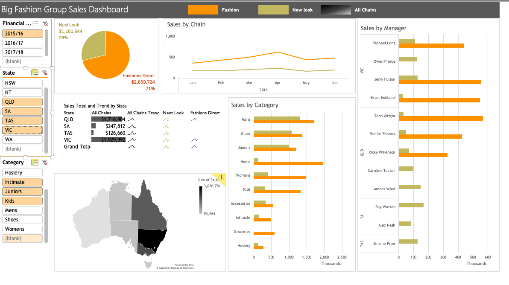

# Sales Performance Dashboard (Excel)

## 📊 Project Overview
This project is an interactive sales performance dashboard built in Microsoft Excel to analyze multi-year sales data across regions, product categories, managers, and retail chains. The dashboard enables stakeholders to quickly identify trends, compare performance, and support data-driven decision-making.

---

## 🔍 Key Business Questions Answered
- How are sales trending over time across financial years?
- Which states and regions generate the highest revenue?
- Which product categories drive the most sales?
- How do sales compare across different retail chains?
- Which managers contribute most to total sales?

---

## 📈 Dashboard Features
- Interactive slicers for financial year, state, and category
- Line charts showing monthly sales trends
- Bar charts for category-level and manager-level performance
- Pie chart comparing sales by retail chain
- Sparklines for quick trend visualization
- Geographic map showing sales distribution by state
- Fully dynamic dashboard updated using Excel’s **Refresh All** feature

---

## 🛠️ Tools Used
- Microsoft Excel  
- Pivot Tables & Pivot Charts  
- Slicers and Interactive Filters  
- Excel Maps and Sparklines  

---

## 🔄 Data Refresh
The dashboard is fully automated. When new sales data is added to the source file, the entire dashboard updates automatically using Excel’s **Refresh All** function.

---

## 💼 Business Use Case
This dashboard can be used by finance teams, sales managers, and executives to:
- Monitor sales performance in real time  
- Identify underperforming regions or categories  
- Support forecasting and planning decisions  
- Improve accountability across sales managers  
- Visualize the performance of each retail chain

---

## 📷 Dashboard Preview

### Main Dashboard

### Interactive Filtering (Slicers)

